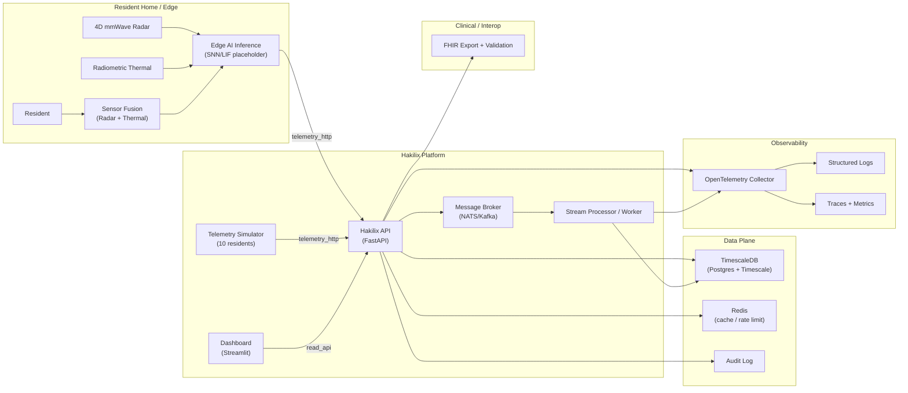

# Hakilix Nexus — Industrial Edge AI Telemetry Demo

Hakilix is a **decentralized, privacy-preserving Edge AI platform** designed to bridge independent living and clinical oversight.
This repository is an **industrial demo stack** showing a full, runnable reference implementation:

- **API** (FastAPI) for authentication, resident management, telemetry ingestion, and risk events
- **TimescaleDB** for time-series telemetry + analytics
- **Inference service** (edge-like) that derives risk signals from streaming vitals / motion proxies
- **Telemetry simulator** that generates demo signals for **10 residents**
- **Glass-style dashboard** (Streamlit) for live snapshot, fleet view, and risk triage

> The system is built to demonstrate *privacy-by-design*: no optical cameras, and all “bio-twin” outputs are abstracted signals.

---

## System Architecture



### Data Flow
1. Telemetry arrives at `POST /v1/telemetry/ingest` (simulated today; sensor fusion in production).
2. API validates device identity + tenant context, then persists telemetry in TimescaleDB.
3. Inference service reads recent telemetry and writes **risk events** (Fall, Respiratory, Dehydration, Wandering).
4. Dashboard renders:
   - **Fleet overview** (risk triage)
   - **Resident live snapshot** (latest vitals + posture/activity)
   - **Risk signals** (aligned card layout)

---

## Quickstart (Docker)

### Prerequisites
- Docker Desktop (Windows/macOS) or Docker Engine (Linux)

### Run
```bash
# from repo root
cp .env.example .env
docker compose up -d --build
```

### Open
- Dashboard: http://127.0.0.1:8501
- API health: http://127.0.0.1:8080/v1/health
- API docs (OpenAPI): http://127.0.0.1:8080/docs

### Demo defaults
- Agency: `A-001`
- Seeded residents: `R-001` … `R-010`
- Telemetry simulator: round-robins across the 10 residents automatically

> If you do not see data within 15–30 seconds, check the troubleshooting section below.

---

## Key Endpoints

- `GET /v1/health`
- `POST /v1/auth/token` (OAuth2 password flow, demo)
- `GET /v1/residents` / `POST /v1/residents` / `PUT /v1/residents/{id}` / `DELETE /v1/residents/{id}`
- `POST /v1/telemetry/ingest`
- `GET /v1/telemetry/recent?resident_id=...`
- `GET /v1/risk/latest?resident_id=...`

---

## Resident Deletion Semantics (Production-Safe Demo)

Deleting a resident triggers a **safe cleanup** to prevent database constraint failures and to keep an auditable trail:
- Devices are **unassigned** (`devices.resident_id = NULL`)
- Resident-bound demo data is deleted (telemetry, risk events)
- An `audit_log` entry records the action and counts

> In production, you would normally use **retention policies** + **soft deletes** + legal hold rather than hard deletion.

---

## Repository Layout

```
hakilix_enterprise_advanced/
  docker-compose.yml
  .env.example
  docs/
    ARCHITECTURE.md
    SECURITY.md
    GCP_DEPLOYMENT.md
    WINDOWS_CMD.md
  services/
    api/
    dashboard/
    inference/
    telemetry_sim/
  infra/
```

---

## Troubleshooting

### Dashboard shows zeros / “n/a”
1. Confirm API is healthy: `curl http://127.0.0.1:8080/v1/health`
2. Confirm telemetry is ingesting:
   ```bash
   docker compose logs --tail 100 hakilix-api
   docker compose logs --tail 100 hakilix-telemetry-sim
   ```
3. Confirm telemetry rows exist:
   ```bash
   docker exec -it hk-et-timescaledb-1 psql -U postgres -d hakilix -c "select count(*) from hakilix.telemetry;"
   ```

### Resident delete returns 500
Check API logs:
```bash
docker compose logs --tail 200 hakilix-api
```

---

## Roadmap to “Highest Standard” Production

This demo is intentionally compact. To harden for production:

- **Identity & access**
  - OIDC (NHS login / Entra ID / Keycloak)
  - mTLS (device ↔ edge ↔ API) with short-lived certs
  - Fine-grained authorization (OPA / Cedar) + attribute-based access control (ABAC)

- **Data security & governance**
  - Vault / Cloud KMS (envelope encryption, key rotation)
  - Row-Level Security (RLS) in Postgres for tenant isolation
  - Immutable audit trail (WORM storage, hash-chained audit events)

- **Reliability**
  - Message broker for ingestion (NATS/Kafka/PubSub) + replay/ordering semantics
  - Backpressure, deduplication, idempotency keys for telemetry ingest
  - SLOs, error budgets, automated rollbacks

- **Observability**
  - OpenTelemetry traces + logs + metrics
  - Structured logs (JSON), correlation IDs, distributed tracing across services

- **Clinical interoperability**
  - Strict FHIR profiling aligned to NHS integration route (Virtual Ward / ICB)
  - Versioned schema + validated transformations + provenance fields

- **ML/Edge**
  - Quantized models + on-device inference
  - Reproducible model registry and evaluation harness
  - Drift detection, calibration, and safe fallback modes

See `docs/SECURITY.md` and `docs/GCP_DEPLOYMENT.md` for suggested production patterns.

---

## Disclaimer
This repository is a **demo/reference implementation** intended for engineering evaluation and prototyping.  
Do not use as-is for clinical decisions without appropriate validation, governance, and regulatory compliance.


## Cloud Run production baseline

This repository includes a GCP deployment baseline:

- Cloud Run services: **API**, **Worker**, **Dashboard**
- Pub/Sub brokered ingestion (API publishes; worker persists + forwards to inference)
- Secret Manager references (sm://...)
- CI workflow + Terraform scaffolding

See:
- `docs/security.md`
- `docs/observability.md`
- `docs/broker.md`
- `infra/gcp/terraform`


## Cloud SQL Postgres (GCP)

For managed PostgreSQL on GCP, use the Terraform in `infra/gcp/terraform`. It provisions Cloud SQL + Cloud Run services and a `hakilix-migrate` Cloud Run Job for schema migrations.

Note: TimescaleDB features are not available on Cloud SQL; the project automatically falls back to standard PostgreSQL indexes and views for analytics.


## Docker Hub publishing (mshaibu)

This repository is pre-wired to publish images to Docker Hub under:

- `mshaibu/hakilix-api`
- `mshaibu/hakilix-worker`
- `mshaibu/hakilix-dashboard`
- `mshaibu/hakilix-inference`
- `mshaibu/hakilix-telemetry-sim`

### Local publish (manual)

```bash
docker login
export TAG=1.0.0

docker build -t mshaibu/hakilix-api:$TAG -f hakilix_enterprise_advanced/services/api/Dockerfile hakilix_enterprise_advanced/services/api
docker build -t mshaibu/hakilix-worker:$TAG -f hakilix_enterprise_advanced/services/worker/Dockerfile hakilix_enterprise_advanced/services/worker
docker build -t mshaibu/hakilix-dashboard:$TAG -f hakilix_enterprise_advanced/services/dashboard/Dockerfile hakilix_enterprise_advanced/services/dashboard
docker build -t mshaibu/hakilix-inference:$TAG -f hakilix_enterprise_advanced/services/inference/Dockerfile hakilix_enterprise_advanced/services/inference
docker build -t mshaibu/hakilix-telemetry-sim:$TAG -f hakilix_enterprise_advanced/services/telemetry_sim/Dockerfile hakilix_enterprise_advanced/services/telemetry_sim

docker push mshaibu/hakilix-api:$TAG
docker push mshaibu/hakilix-worker:$TAG
docker push mshaibu/hakilix-dashboard:$TAG
docker push mshaibu/hakilix-inference:$TAG
docker push mshaibu/hakilix-telemetry-sim:$TAG
```

### CI publish (GitHub Actions)

Workflow: `.github/workflows/publish-dockerhub.yml`

Create these GitHub repository secrets:

- `DOCKERHUB_USERNAME` (e.g. `mshaibu`)
- `DOCKERHUB_TOKEN` (Docker Hub access token)

On push to `main`, images are published with:
- `latest` (default branch)
- `sha-<short>` (commit)

On tag (e.g. `v1.0.0`), images are also tagged with the version.

### Run locally by pulling from Docker Hub (no local build)

Set the tag you want and pull:

```bash
export TAG=latest
docker compose pull
docker compose up -d
```

(Your `docker-compose.yml` includes both `image:` and `build:`. `pull` + `up` will use the remote images; omit `pull` to build locally.)

See `docs/DOCKERHUB.md` for more.
